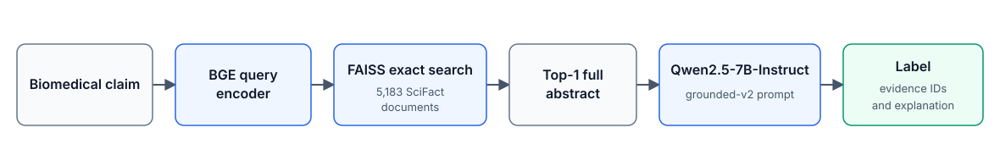
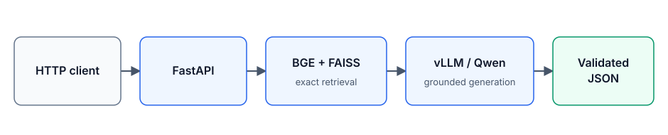

# Biomedical Evidence Retrieval & Verification

[](https://github.com/boweiye2u/biomedical-evidence-verification/actions/workflows/tests.yml)

An evidence-grounded biomedical claim verification system evaluated on SciFact. It retrieves scientific articles with zero-shot BGE and exact FAISS search, supplies the top-ranked full abstract to Qwen2.5-7B-Instruct, and returns a structured `SUPPORT`, `CONTRADICT`, or `INSUFFICIENT` decision with citations. The repository covers controlled retrieval experiments, evidence-selection diagnostics, a single frozen held-out TEST evaluation, and local serving with FastAPI and vLLM.

## Architecture





## Key results

The TEST results below come from the first frozen evaluation of the selected system. TEST was not used for prompt, checkpoint, or architecture selection.

| Held-out SciFact TEST retrieval | Value |
|---|---:|
| NDCG@10 | 0.7404 |
| Recall@10 | 0.8742 |
| Recall@100 | 0.9667 |
| MRR@10 | 0.7034 |

| Held-out SciFact TEST verification | Value |
|---|---:|
| Accuracy | 0.7000 |
| Macro F1 | 0.6859 |
| SUPPORT F1 | 0.7480 |
| CONTRADICT F1 | 0.6080 |
| INSUFFICIENT F1 | 0.7018 |
| Gold-document diagnostic accuracy | 0.8300 |
| Gold-document diagnostic macro F1 | 0.8003 |

| Single-L40S serving, concurrency 8 | Value |
|---|---:|
| End-to-end throughput | 4.34 requests/s |
| P50 latency | 1.65 s |
| P95 latency | 2.43 s |
| Retrieval latency | 13–22 ms |
| FAISS search | <1 ms |
| Peak GPU memory | 34.9 GiB |
| Failures / invalid outputs | 0 / 0 |

See the [final project summary](docs/final-project-summary.md), [held-out TEST report](docs/milestone6a-final-test-report.md), and [serving report](docs/milestone6b-serving-report.md) for scope and uncertainty.

## What was tested

- BM25, zero-shot BGE, and MedCPT dual-encoder retrieval baselines
- controlled BGE fine-tuning with random versus zero-shot-BGE-mined negatives
- three-seed replication and cluster-aware DEV analysis
- MedCPT cross-encoder reranking
- sentence-level evidence localization and annotated-rationale diagnostics
- frozen end-to-end verification on held-out SciFact TEST
- single-GPU FastAPI and vLLM serving at concurrency 1, 4, and 8

## Main findings

- Zero-shot BGE remained the most robust retrieval choice; random-negative tuning approximately preserved its DEV performance.
- The tested zero-shot-BGE mining policy degraded DEV retrieval across seeds. This does not establish that hard negatives are generally harmful.
- MedCPT reranking improved the BEIR cited-document ranking target but did not improve downstream verification.
- A single selected sentence often removed useful context; the top-1 full abstract remained the strongest tested end-to-end evidence format.
- Evidence selection and verifier reasoning were separate bottlenecks. Qwen still made polarity and causal-direction errors with annotated documents.
- vLLM continuous batching substantially increased throughput with a moderate latency increase.

## Repository layout

```text
configs/       Frozen experiment, split, model, and serving settings
retrieval/     Retrieval, evaluation, training, statistics, and verification code
serving/       FastAPI schemas, retriever, vLLM client, and structured logging
scripts/       Data preparation, experiments, evaluation, serving, and benchmarks
tests/         Retrieval, training, verification, TEST-protocol, and serving tests
docs/          Concise results plus full milestone reports and small JSON summaries
environments/  Portable environment intent and exact package snapshots
```

Datasets, model weights, checkpoints, embeddings, FAISS indexes, raw generations, request logs, and Conda environments live under `RAG_ROOT` and are excluded from Git.

## Reproducing

Linux with an NVIDIA GPU is the tested setup. Commands run from the repository root.

```bash
export RAG_ROOT="${RAG_ROOT:-$HOME/rag}"
source scripts/env.sh
conda env create --prefix "$RAG_ROOT/envs/retrieval" -f environments/retrieval.yml
conda activate "$RAG_ROOT/envs/retrieval"
python -m pip install torch==2.9.1 --index-url https://download.pytorch.org/whl/cu126
python -m pip install -r environments/retrieval-requirements.txt
python -m scripts.prepare_scifact
python -m pytest -q --ignore=tests/test_serving_6b.py
```

`prepare_scifact` downloads the public BEIR SciFact and original SciFact releases, validates their mapping, and recreates the frozen TRAIN/DEV split. Models must be obtained from their official Hugging Face repositories at the revisions in [model-revisions.json](configs/model-revisions.json). Large artifacts remain outside this repository.

The scripts are milestone-oriented and refuse to overwrite many frozen run directories. Follow the reports in order when reproducing the complete study:

1. [SciFact mapping and split](docs/scifact-mapping-report.md)
2. [retrieval baselines](docs/scifact-dev-baselines.md)
3. [training and replication](docs/milestone4a-audit.md)
4. [verification and evidence selection](docs/milestone5a-verification-dev-report.md)
5. [one-time final TEST protocol](docs/milestone6a-final-test-report.md)
6. [local serving](docs/milestone6b-serving-report.md)

Do not rerun or tune against TEST as part of ordinary reproduction. The checked-in final report and result JSON preserve the original frozen evaluation.

### Serving environment

The measured server used Python 3.11, vLLM 0.9.2, PyTorch 2.7.0+cu126, and one NVIDIA L40S. Recreate a separate environment and download the pinned Qwen checkpoint into `$RAG_ROOT/models/Qwen2.5-7B-Instruct`; keep the BGE snapshot in the Hugging Face cache configured by `scripts/env.sh`.

```bash
conda create --prefix "$RAG_ROOT/envs/serving" python=3.11 pip -y
"$RAG_ROOT/envs/serving/bin/python" -m pip install \
  vllm==0.9.2 transformers==4.53.2 fastapi==0.116.1 \
  'uvicorn[standard]==0.35.0' httpx==0.28.1 psutil==7.0.0 \
  faiss-cpu==1.11.0.post1 pytest==8.4.1
scripts/start_vllm_6b.sh   # terminal 1
scripts/start_api_6b.sh    # terminal 2
```

### Docker serving

The container packages the frozen FastAPI and vLLM serving code; model checkpoints,
the SciFact corpus, cached embeddings, the FAISS index, and request logs remain
external under `$RAG_ROOT`. Build the Python 3.11 image from the repository root:

```bash
docker build -t biomedical-evidence-verification:6b .
```

Run vLLM and FastAPI in separate terminals on the same Linux host network, mounting
the existing artifact root at `/artifacts`:

```bash
# Terminal 1: frozen Qwen generator
docker run --rm --gpus all --network host --ipc=host \
  -v "$RAG_ROOT:/artifacts" \
  biomedical-evidence-verification:6b \
  vllm serve /artifacts/models/Qwen2.5-7B-Instruct \
    --served-model-name qwen2.5-7b-instruct --dtype bfloat16 \
    --max-model-len 16384 --gpu-memory-utilization 0.72 --max-num-seqs 16 \
    --generation-config vllm --host 127.0.0.1 --port 8001 \
    --disable-log-requests

# Terminal 2: BGE retrieval and FastAPI
docker run --rm --gpus all --network host \
  -v "$RAG_ROOT:/artifacts" \
  -e RAG_ROOT=/artifacts \
  biomedical-evidence-verification:6b
```

The mount must contain the artifact paths referenced by
[serving-6b-v1.json](configs/serving-6b-v1.json), including the BGE snapshot,
SciFact corpus, cached FAISS index, and Qwen checkpoint. The service writes its
structured request log below `/artifacts/runs/`, so that mount must be writable.
GPU execution requires an NVIDIA driver and NVIDIA Container Toolkit; model weights
are never baked into the image.
A GitHub Actions workflow is provided to validate the Docker image build from a
clean checkout. GPU container serving has not yet been runtime-validated.

### Continuous integration

GitHub Actions runs the model-free CPU test selection automatically on pushes and
pull requests. GPU inference, vLLM startup, model downloads, full-corpus evaluation,
and serving benchmarks are intentionally excluded from hosted CI.

### Serving examples

```bash
curl http://127.0.0.1:8000/health

curl -X POST http://127.0.0.1:8000/retrieve \
  -H 'Content-Type: application/json' \
  -d '{"claim":"A biomedical claim to retrieve evidence for."}'

curl -X POST http://127.0.0.1:8000/verify \
  -H 'Content-Type: application/json' \
  -d '{"claim":"A biomedical claim to verify."}'
```

The production `/verify` path is frozen at top-1. Invalid model output is surfaced with parse errors and retained in structured logs; it is not silently repaired.

## Reproducibility

- model names and revisions are pinned in configs
- the TRAIN/DEV split and related-claim groups are checked in
- retrieval uses normalized FP32 embeddings and exact `IndexFlatIP` search
- prompt text, prompt hash, evidence budget, and decoding settings are frozen
- small aggregate and per-query summaries are retained in `docs/`
- exact environment snapshots accompany the portable requirements
- tests cover metrics, mappings, loss behavior, evidence formatting, TEST isolation, serving validation, and deterministic retrieval

## Limitations

- SciFact is small and its cited-document retrieval labels differ from its verification-evidence annotations.
- DEV was reused for development and diagnostic analysis; only the final frozen system was evaluated on TEST.
- The gold-document condition is diagnostic rather than a strict upper bound.
- Qwen reasoning errors remain even when annotated evidence is supplied.
- Conclusions about mining, reranking, and localization apply to the tested policies and configuration.
- Serving results are specific to a single node, one L40S, and the measured software and request mix.

## Acknowledgments

This project uses [SciFact](https://github.com/allenai/scifact), [BEIR](https://github.com/beir-cellar/beir), [BGE](https://huggingface.co/BAAI/bge-base-en-v1.5), [MedCPT](https://huggingface.co/ncbi/MedCPT-Query-Encoder), [Qwen2.5](https://huggingface.co/Qwen/Qwen2.5-7B-Instruct), [FAISS](https://github.com/facebookresearch/faiss), [vLLM](https://github.com/vllm-project/vllm), and [FastAPI](https://github.com/fastapi/fastapi). Dataset and model artifacts retain their own licenses and terms.

## License

Project-authored code and documentation are released under the [MIT License](LICENSE). Third-party datasets, models, and dependencies are governed by their respective licenses.
